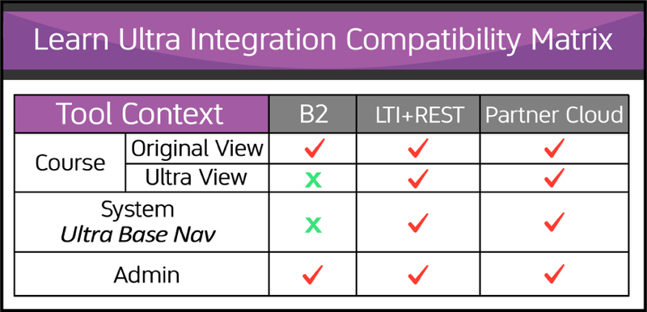

# Blackboard App Catalog - FAQ
*Author: Darek Sady*  
*Categories: []*  
*Tags: ['developer']*  

## 1. How does the Blackboard App Catalog Work?

 - All Partners in the [Blackboard Partnerships Program](https://www.blackboard.com/partnerships/become-a-partner) are listed on the [App Catalog Partners](https://appcatalog.blackboard.com/list-partners/) page and are able to submit detailed information for each of their "Apps" (integrations) to the App Catalog. Submitted Apps are reviewed by the Blackboard App Catalog team and appear in the App Catalog upon approval.
  - The App Catalog enables anyone to browse, search, or filter the Apps by integration type (LTI + REST, Building Block, Partner Cloud) or Category (Accessibility, Admin/Support Tool, Assessment, Classroom Tool, Consulting/Dev Services, Content, Data Insights, Multimedia, Safety/Security, SIS/System Integrator).
 - The new Blackboard App Catalog uses [OpenChannel](https://openchannel.io/) - an experienced provider of LMS integration marketplace solutions in the educational space.

## 2. What does "ULTRA READY" mean?

<table border="0">
  <tr>
    <td valign="top">The "ULTRA READY" badge indicates that the App is supported and compatible with the Ultra Experience of Blackboard Learn. any integration listed as “Ultra Ready” is labeled as such to indicate it was built leveraging only Blackboard integration frameworks specifically supported in Ultra (i.e. Partner Cloud, LTI 1.1+ and/or Learn REST APIs).  The term "Ultra Ready" is not equivalent to a Blackboard certification status for the Ultra experience. The designation of “Ultra Ready” is made by the developer of the integration and not by Blackboard and, as such, does not designate a Blackboard certification status for the Ultra experience.*
  </td>
    <td valign="top">
      
    </td>
  </tr>
</table>

## 3. What's the difference between the 3 integration types (LTI + REST, Building Blocks, & Partner Cloud)?

 - _**LTI + REST:**_ LTI + REST apps are those integrations that rely on and utilize [LTI Tool Placements](https://help.blackboard.com/Learn/Administrator/SaaS/Integrations/Learning_Tools_Interoperability) and/or [Blackboard Learn REST APIs](https://help.blackboard.com/Learn/Administrator/SaaS/Integrations/Compare_Building_Blocks_and_Rest#why-rest-apis_OTP-1). LTI + REST apps are compatible across all flavors and delivery methods of Blackboard Learn (Original and Ultra experiences) and have no association with legacy Blackboard Building Blocks.
 - _**Building Block:**_ While only fully functional in the Original Experience of Blackboard Learn, for any [Building Blocks](https://help.blackboard.com/Learn/Administrator/SaaS/Building_Blocks) that are installed on a Blackboard Learn environment with the Ultra Experience enabled, the functionality of the integration will only be available in courses using the Original course view. Building Block functionality is not compatible with the Ultra experience of Learn including anywhere within the Ultra base navigation (outside of the course context) or within Ultra view courses.
  - _**Partner Cloud:**_ Natively available in all flavors and delivery methods of Blackboard Learn (Original and Ultra experiences), [Partner Cloud](https://help.blackboard.com/Learn/Administrator/SaaS/Integrations/Content_Market#partner-content-in-the-content-market_OTP-0) Apps and have no association with a legacy Blackboard Building Block. The Blackboard Partner Cloud streamlines our inventory of content integrations into a single registration and activation process, eliminates Building Block version control issues, and accelerates the delivery of new partner features and product updates. Via the course-embedded [Content Market tool](https://help.blackboard.com/Learn/Instructor/Course_Content/Create_Content/Add_Content_From_External_Sources#content-market_OTP-0), instructors and course builders can access ready-made material from textbook publishers to enhance their curriculum and provide students with supplementary materials that aid in learning. At the same time, sensitive student data remains private and secure.

## 4. How can I tell which integrations work for Original vs. Ultra? ##

It can be a bit tricky, but this Ultra Compatibility Matrix provides a bit of clarity:

\**The 3rd party Ultra Ready integrations available through the Blackboard App Catalog allow you to use the named 3rd party service with the Ultra experience in Blackboard Learn. By enabling any 3rd party integrations you agree that any use of the a 3rd party service is governed solely by the terms of use by the named 3rd party (and you shall comply with all such terms of use). Any contract entered into, services provided, or any transaction completed via the named 3rd party is between you and that party, and not Blackboard. Blackboard makes no representation with respect to the named 3rd parties and shall have no liability or obligation whatsoever in relation to the content provided to or available at, use of, or correspondence with, the named 3rd party or any transactions completed and any contract entered into by you with any named 3rd party. Further, by authorizing a 3rd party integration, you authorize Blackboard to provide limited personal information required for the named 3rd party (“Integration Information”). You agree that Blackboard is not responsible for the data privacy and security practices of named 3rd party and Blackboard is not liable for any unauthorized access to the Integration Information. You accept that you are solely responsible for meeting any applicable requirements and the consequences of authorizing named 3rd party to access the Integration Information.*
