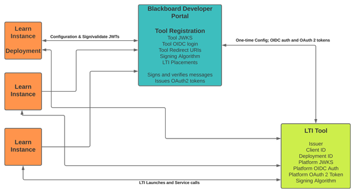

# LTI Registration and Deployment with Learn

## Why do we use a central service at Anthology?

We believe that having Tool vendors register an LTI Tool _once_ through [the Developer Portal](https://developer.blackboard.com/){:target="_blank"} is the best approach. It allows Learn admins to deploy that tool by entering just one piece of information (the Client ID) in the Admin Panel and sharing another piece of information (the Deployment ID) with the Tool vendor.

_Tool vendor's clients don't need to register individual applications with the Developer Portal. That defeats the entire purpose of building this centralized service to make everyone's life a little simpler._

When a Tool vendor needs to make changes to their tool configuration they do it in one place for Learn: the Developer Portal. If they add a new redirect URL, change the name of their application, or if they need to change the attributes of a placement (such as the icon, name, or target link URL) they can do so in one place. Learn admins can then synchronize their deployment without having to make those changes themselves: all the information required to perform an LTI launch is retrieved from the Developer Portal.

## LTI 1.3/Advantage Security

With LTI 1.3, an LTI Tool or Tool Provider shares a lot of information with a Tool Consumer or Platform and we must manage the signing and validation of the payload in a very different way than with the previous versions.

With LTI 1.1, we used to exchange just 3 pieces of information: Key, Secret, and URL. LTI 1.1 uses OAuth 1.0a signing of the FORM POST parameters to ensure that the data is secure. With LTI 1.3, the entire security model has changed.

The LTI 1.3/Advantage security model is based on OAuth 2 and OpenID Connect. It uses client credentials grant for getting bearer tokens, just like our REST API mechanism but rather than issuing keys and secrets we rely on asymmetric public/private key pairs.

Learn is responsible for generating a private key that signs the LTI messages it sends to the tool, and it makes its public key(s) available via a JWKS URL for the tool to validate the signature of those messages.

A tool is responsible for generating a private key that it uses to sign OAuth 2 bearer token requests for LTI messages it sends to Learn, such as Deep Linking response, Names and Roles, and Assignment and Grades. It provides a JWKS URL for its public key(s) so Learn can validate the signature of messages the tool sends to Learn.

## LTI 1.3 Registration

Because of the new security model and because LTI 1.3 has built-in support for preventing cross-site request forgery attacks (CSRF or XSRF), there is more information that needs to be shared between a tool and a platform.

The LTI 1.3 specification requires that a Tool share the following:

1. Login Initiation URL
2. Tool Redirect URL(s)
3. Tool JWKS URL
4. Signing Algorithm (RS256 or RS512 are the current choices)

The above values are defined by the OpenID Connect 3rd-party-initiated login flow and the fact that we are using asymmetric keys.

The specification also requires that a Platform share the following information with the tool:

1. Client ID
2. Issuer
3. Auth token endpoint
4. OIDC auth request endpoint
5. Platform JWKS URL
6. Deployment ID

The first 5 come from the OAuth 2 and OpenID Connect specifications upon which the LTI 1.3 security model is built.

The Deployment ID is an LTI 1.3 construct to allow multiple deployments of a tool for a single Client ID, such as different colleges at a university.

We've gone from three pieces of information to share between a platform and tool in LTI 1.1 to ten pieces of information that must be shared.

## Anthology Developer Portal

With LTI 1.3, since keys and secrets are no longer shared, and the signing of messages uses asymmetric public/private key pairs, Blackboard has the opportunity to generate its keys in a central service and do the signing and validation of messages there.

With Learn we have split the _registration_ of a tool from the _deployment_ of a tool.

Rather than ask a Learn administrator to exchange all of the above information with a Tool vendor (which is information the Learn admin doesn't care about and could easily make mistakes in entering) and in order to make both the Tool vendor and the Learn admin lives a bit better, we have centralized the registration of a tool.

A Tool vendor registers their tool _once_ with the Blackboard Developer Portal, exchanging all of the information above _except_ the Deployment ID. The tool vendor is granted a Client ID and shares it with their clients.

A Learn admin takes that Client ID and deploys it to Learn by entering a single value (the Client ID) in the Admin Panel. All the rest of the information required to perform an LTI launch from that Learn instance is retrieved from the Developer Portal.

A Learn admin is granted a Deployment ID that it shares with the Tool vendor to uniquely identify the account associated with that institution. A Tool vendor now has all the information they need to accept LTI launches from that institution.

## LTI Links or Placements

Another aspect of LTI that the specification does not address is the issue of where an LTI link gets surfaced and what type of links do they support.

A tool may want a link in the course outline, or in the rich content editor, or in a system-wide area, or as a link for a course but not in the outline.

A tool may want to support Deep Linking so an instructor can select or create content in the Tool and have the links appear in the course.

Learn has the concept of LTI Placements to support this. Blackboard allows a Tool vendor to register those placements with the Developer Portal, so an admin doesn't have to do that work.

{: .center-image }

If you have any other questions about LTI Registration and Deployment with Learn, [let us know](mailto: developers@blackboard.com).